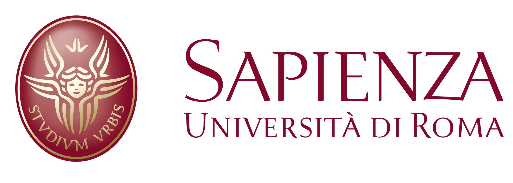
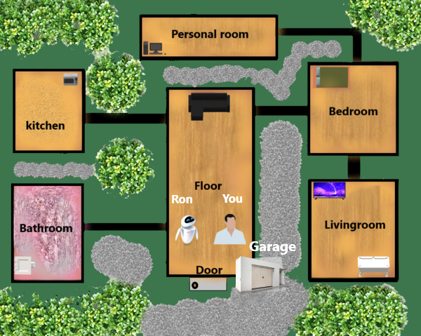

# Welcome to Vannoli Marco github 
## Simulation of interaction between Robot and User (Human) in order to perform the task using an AI planning approach defined by Domain Definition Language (PDDL)

## Abstract
The project aims to make use of artificial intelligence
algorithms to solve various everyday problems. The
choices of the project concern an attempt to recreate a
simulation of the interaction between the user and the
domestic robot. One brief about AI Planning: The planning problem in Artificial Intelligence is about the decision making performed by intelligent creatures like robots,
humans, or computer programs when trying to achieve
some goal. It involves choosing a sequence of actions
that will (with a high likelihood) transform the state of the
world, step by step so that it will satisfy the goal. The
world is typically viewed to consist of atomic facts (state
variables), and actions make some facts true and some
facts false. The desire to have an interaction between
man and robot in such a way that the latter can intelligently plan the execution of a particular task has given
way to the project here present. The method chosen
as we will see will be the use of Python libraries dedicated
to artificial intelligence algorithms. In the following
sections, all aspects of the project from structure to the
final simulation will be described.

## Introduction 
The project is based on to perform a Gui interaction between Ron(Robot) and the User.
Ron is a robot that can perform the same tasks inside the home of the User.
The user can decide which tasks Ron can do and decide on some aspects that are important in order to perform
each. The project uses files of type pickle and txt and uses them
as a Database in order to have a track of data that the user selected during one session
of the project. So, Ron starts with one only action (Move inside rooms) and
the user will select the actions that are necessary to
perform the entire task chosen. The project uses aima library that performs many AI algorithms
using PDDL formalism in order to find the solution. These algorithms allow us to find the solutions
knowing the information provided by the user and Ron. This project use aima to find a solution and convert all this information included the solution
from PDDL into an important representation that we need in order to create interaction and built all scene about tasks. This algorithm allows us to represent a task with PDDL formalism, thus Ron is able to perform
any task that users decide to choose. 

Ron :  `=============>` User : 

## How run the project
Before to run the project, is necessary to install all package 
that the project needs:
 
## Contact
my email: vannolimarco@hotmail.it

`pip install -r requirements.txt`

OR

`pip install -r requirements.txt --no-index --find-links`

Then,

`python MainRonRobot.py`

The project start with this interface:

In this section the User decide the name and start the Interaction:

In this section, you can choose the Task that Ron ha sto perform,
Or you can vie the Model of Home of user in order to have an idea to 
of rooms that haa the Home and finally you can delete all Database that
includes Name, Actual Actions that Ron not has. Thus, if you delete the database,
the actions chosen during a entire session are deleted and Ron has to ask you
which actions you want to choose in order to perform the task.
 
The map of home is this:

The Task that Ron can performs are:
- [x] Bring to me keys
- [x] Bring to me food delivered
- [x] On/Off Tv
- [x] Cook me something
- [x] Open/Close Garage

Once Ron will be able to find the solution of planning, then the simulation will be started:
Example (Ron takes Food Delivered):

## skeleton of project
      |_aima       #all library of Aima ( All algorithm)
      |_Image # All images used into the project
      |_StorageData #All files used as Database in order to have all data necessary to
                    # repeat each session with all data saved as Actions and Name of user
                    # The project provide a section that allow to delete entire database
                    # in this way is possible to repeat the project with news Data.
      |__ DefineActionsPlan.py
      |__ Gui.py
      |__ MainRonRobot.py
      |__ README-md this file
      !__ requirements.txt #all package necessary to run the project
      |__ RonEnvironment.py #the file that create the scene of tasks
      |__ RonPlanning.py #The file that create the Domain and knoledge to perform the 
                         #Algorithm
      |__ RonTasks.py #The file that select the Ron Tasks
      |__ Settings.py #The file that cointains alla global variable used during single sesssion
      |__ Utils.py #The file that have some utils methods
      |__ ReportProjectPlanning_Vannoli_1860363.pdf #the report of the rpoject
      

##Package used for this project (Python 3.6)
- more-itertools==8.1.0
- jaraco.collections==3.0.0
- networkx==1.11
- jaraco.functools==3.0.1
- ipythonblocks==1.9.0
- PySimpleGUI==4.34.0
- pygame==1.9.6
- pickle #inclused

## About The project
All information about each step of the project is reported by the report in the folder.
## information
The project aims to create an interaction between Ron(Robot) and the User.
The User will choose the Task and some aspect of the task. Once has all
the actions necessary in order to perform the task, a scene Of Home
of User (an image) will be rendered with all object and protagonists chosen for the task.
The rendering of the scene is performed by PySimpleGUI( version==4.34.0).

